# Frontend System Analysis and Design

## 1. Document Overview

This document describes the analysis and design of the frontend system for **GPet Vet AI**, a web-based pet healthcare assistant platform. The frontend is implemented as a **React Vite Single Page Application (SPA)** and deployed on Vercel.

The frontend provides the user interface for authentication, pet profile management, knowledge upload, content browsing, AI chatbot interaction, and system settings.

## 2. Frontend Objectives

The frontend system is designed to:

- Provide a clean and responsive web interface for pet owners.
- Support user registration, login, and authenticated application access.
- Allow users to manage multiple pet profiles.
- Allow users to upload pet-related medical knowledge.
- Display uploaded content and processing status.
- Provide a chat interface for AI-powered veterinary assistance.
- Communicate with the FastAPI backend through REST APIs.
- Maintain client-side state for authentication, selected pet, and chat sessions.
- Be deployable as a static SPA on Vercel.

## 3. Frontend Architecture Summary

The frontend follows a modular SPA architecture:

- **React** handles component rendering.
- **Vite** provides development and production build tooling.
- **React Router** handles client-side routing.
- **Zustand** manages client-side application state.
- **Axios** handles HTTP communication with the backend API.
- **Tailwind CSS** provides styling utilities and responsive layout.
- **Lucide React** provides consistent iconography.

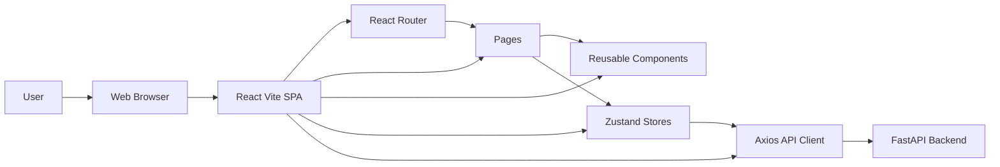

## 4. Single Page Application Design

GPet Vet AI frontend is a Single Page Application. The browser loads the frontend once, and page transitions are handled on the client side by React Router.

Characteristics:

- The application is loaded from `index.html`.
- React mounts the app through `main.jsx`.
- Routes are defined in `App.jsx`.
- Navigation between pages does not require full page reload.
- Data is loaded through API calls to the backend.
- Protected routes are controlled by JWT state in `authStore`.

## 5. Frontend Project Structure

```txt
thucung-web/
├── src/
│   ├── api/
│   │   ├── authApi.js
│   │   ├── chatApi.js
│   │   ├── client.js
│   │   ├── contentApi.js
│   │   └── petApi.js
│   ├── components/
│   │   ├── chat/
│   │   ├── content/
│   │   ├── layout/
│   │   ├── pet/
│   │   └── upload/
│   ├── pages/
│   ├── store/
│   ├── App.jsx
│   ├── index.css
│   └── main.jsx
├── package.json
├── vite.config.js
└── vercel.json
```

## 6. Frontend Module Description

| Module | Responsibility |
| --- | --- |
| `src/api` | API communication layer using Axios |
| `src/store` | Client-side state management using Zustand |
| `src/pages` | Route-level screen components |
| `src/components/layout` | Application shell, sidebar, navbar, mobile navigation |
| `src/components/pet` | Pet profile card and pet form |
| `src/components/upload` | Upload dropzone and upload progress |
| `src/components/content` | Content item viewer |
| `src/components/chat` | Chat interface, chat input, chat message |
| `src/index.css` | Global design system and Tailwind extensions |

## 7. Routing Design

Routes are defined in `App.jsx`.

| Route | Page | Access |
| --- | --- | --- |
| `/` | LandingPage | Public |
| `/login` | LoginPage | Public |
| `/register` | RegisterPage | Public |
| `/app` | DashboardPage | Protected |
| `/app/pets` | PetProfilePage | Protected |
| `/app/upload` | UploadPage | Protected |
| `/app/content` | ContentPage | Protected |
| `/app/chat` | ChatPage | Protected |
| `/app/settings` | SettingsPage | Protected |

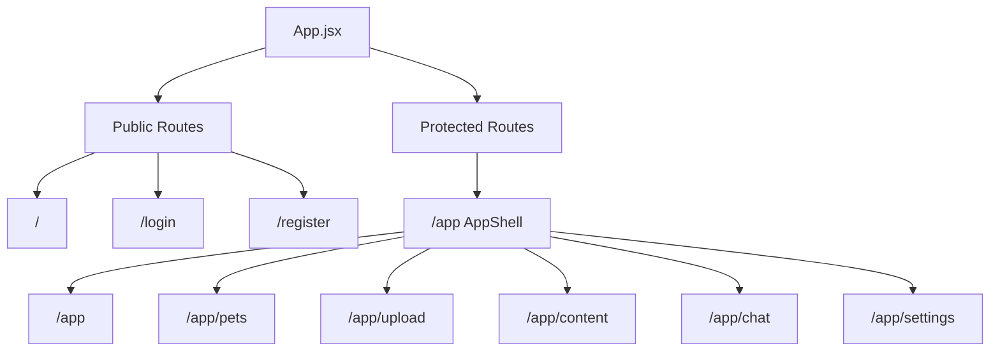

## 8. Protected Route Design

Protected pages are wrapped by `ProtectedRoute`. The route checks whether a JWT token exists in `authStore`.

Logic:

1. If token exists, render the protected page.
2. If token does not exist, redirect to `/login`.

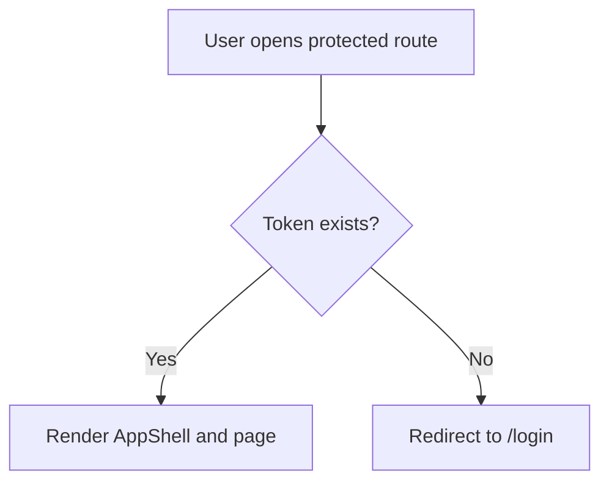

## 9. Layout Design

Protected pages share a common layout through `AppShell`.

Layout components:

- `Sidebar`: desktop navigation.
- `Navbar`: top bar with user information and logout button.
- `MobileNav`: bottom navigation for mobile screens.
- `Outlet`: renders the active protected page.

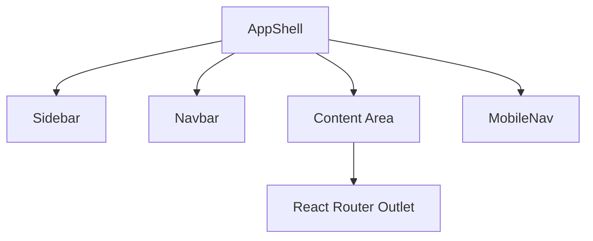

## 10. State Management Design

The frontend uses Zustand stores for lightweight state management.

### 10.1. Auth Store

File: `src/store/authStore.js`

Responsibilities:

- Store JWT token.
- Store current user.
- Handle login.
- Handle register.
- Handle logout.
- Persist token and user in local storage using Zustand middleware.

Main state:

```txt
token
user
loading
error
```

### 10.2. Pet Store

File: `src/store/petStore.js`

Responsibilities:

- Store pet list.
- Store selected pet id.
- Fetch pets from backend.
- Create pet.
- Delete pet.
- Select pet.

Main state:

```txt
pets
selectedPetId
loading
```

### 10.3. Chat Store

File: `src/store/chatStore.js`

Responsibilities:

- Store chat messages.
- Store current chat session id.
- Send message to backend.
- Append user and assistant messages.
- Reset chat state.

Main state:

```txt
messages
sessionId
loading
```

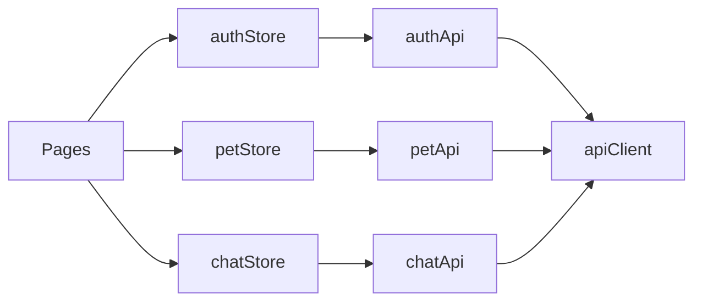

## 11. API Communication Design

The frontend communicates with the backend using Axios.

File: `src/api/client.js`

Key behavior:

- Base URL is read from `VITE_API_BASE_URL`.
- If no environment variable is provided, local backend is used.
- JWT token is automatically attached to protected requests.

```txt
Authorization: Bearer <token>
```

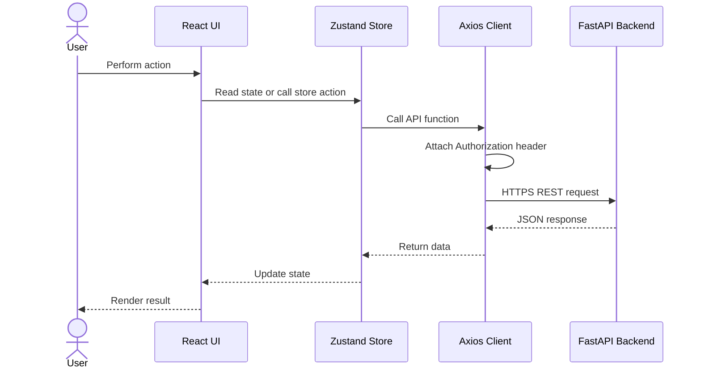

## 12. API Layer Design

| File | Backend Endpoint Group |
| --- | --- |
| `authApi.js` | `/auth` |
| `petApi.js` | `/pets` |
| `contentApi.js` | `/content` |
| `chatApi.js` | `/chat` |
| `client.js` | Shared Axios configuration |

### 12.1. Authentication API

Used by:

- `LoginPage`
- `RegisterPage`
- `authStore`

Operations:

- Register user.
- Login user.
- Retrieve current user if needed.

### 12.2. Pet API

Used by:

- `DashboardPage`
- `PetProfilePage`
- `UploadPage`
- `ChatPage`

Operations:

- List pets.
- Create pet.
- Update pet.
- Delete pet.

### 12.3. Content API

Used by:

- `UploadPage`
- `ContentPage`

Operations:

- Upload file.
- List content items.
- Track processing result.

### 12.4. Chat API

Used by:

- `ChatPage`
- `ChatInterface`
- `chatStore`

Operations:

- Send chat message with `pet_id`, `message`, and optional `session_id`.
- Receive `session_id`, `answer`, and `citations`.

## 13. Page-Level Design

### 13.1. Landing Page

Purpose:

- Introduce GPet Vet AI.
- Explain value proposition.
- Provide entry points to login and register.

### 13.2. Login Page

Purpose:

- Authenticate existing users.
- Store returned JWT token and user data.
- Redirect authenticated users to `/app`.

### 13.3. Register Page

Purpose:

- Create a new user account.
- Store returned JWT token and user data.
- Redirect new users to `/app`.

### 13.4. Dashboard Page

Purpose:

- Show system overview.
- Display pet count and workspace status.
- Provide quick navigation to pet profile and AI chat.
- Display existing pet cards.

### 13.5. Pet Profile Page

Purpose:

- Display all pet profiles.
- Create new pet profile.
- Select active pet.
- Delete pet with confirmation.

### 13.6. Upload Page

Purpose:

- Select a pet.
- Upload medical records, images, audio, or video.
- Show upload progress.
- Show upload pipeline explanation.

### 13.7. Content Page

Purpose:

- Display uploaded content items.
- Show content status.
- Provide empty state when no content exists.

### 13.8. Chat Page

Purpose:

- Select a pet.
- Display AI safety disclaimer.
- Provide chat interface.
- Send messages to backend RAG chatbot.
- Display AI answers and citations.

### 13.9. Settings Page

Purpose:

- Display production service configuration.
- Show backend URL, Gemini usage, embedding model, and MongoDB Atlas usage.

## 14. Component Design

### 14.1. Layout Components

| Component | Purpose |
| --- | --- |
| `AppShell` | Shared layout for protected routes |
| `Sidebar` | Desktop navigation |
| `Navbar` | User info and logout action |
| `MobileNav` | Mobile bottom navigation |
| `navLinks` | Shared navigation configuration |

### 14.2. Pet Components

| Component | Purpose |
| --- | --- |
| `PetCard` | Display pet summary, selected state, delete action |
| `PetProfileForm` | Create new pet profile |

### 14.3. Upload Components

| Component | Purpose |
| --- | --- |
| `UploadDropzone` | File selection UI |
| `UploadProgress` | Upload progress bar |

### 14.4. Content Components

| Component | Purpose |
| --- | --- |
| `DocumentViewer` | Display content item metadata and status |
| `TranscriptViewer` | Future transcript display support |

### 14.5. Chat Components

| Component | Purpose |
| --- | --- |
| `ChatInterface` | Main chat container |
| `ChatInput` | Message input and send button |
| `ChatMessage` | User and assistant message bubble |

## 15. Main User Flows

### 15.1. Login Flow

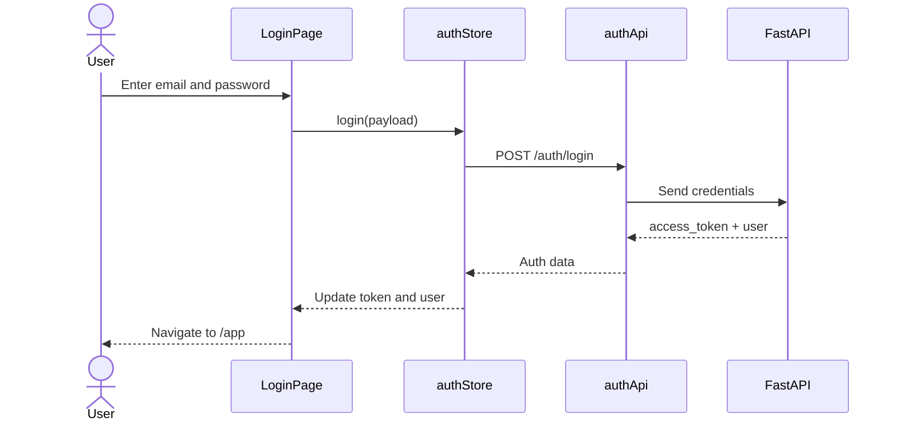

### 15.2. Pet Creation Flow

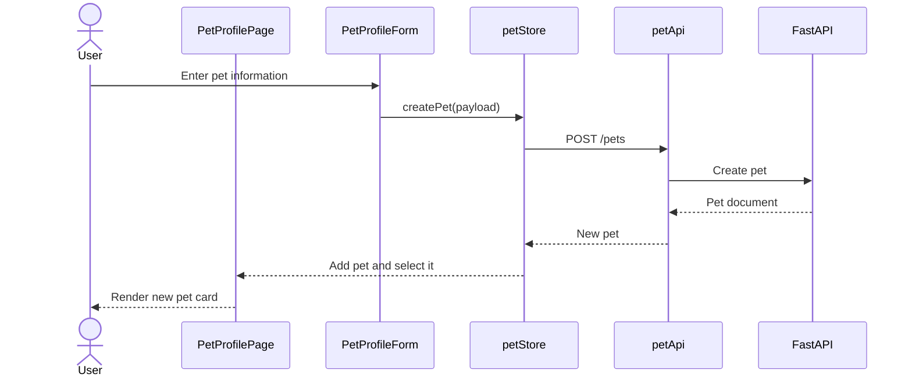

### 15.3. Pet Deletion Flow

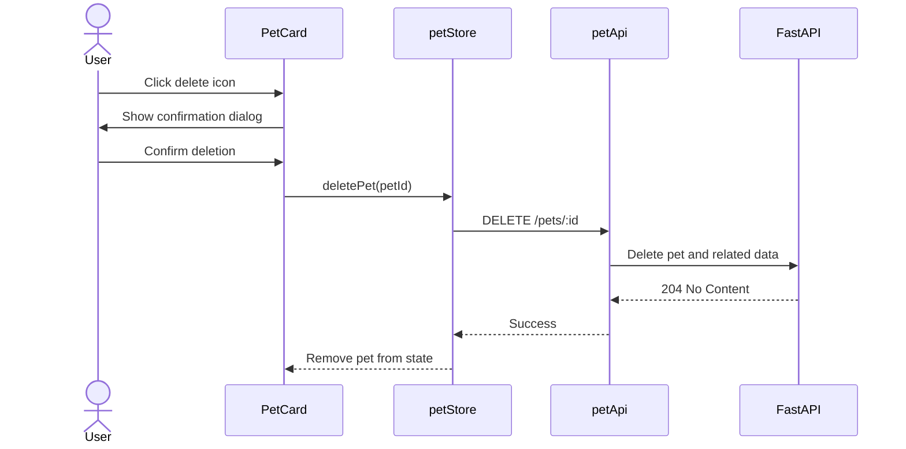

### 15.4. Upload Flow

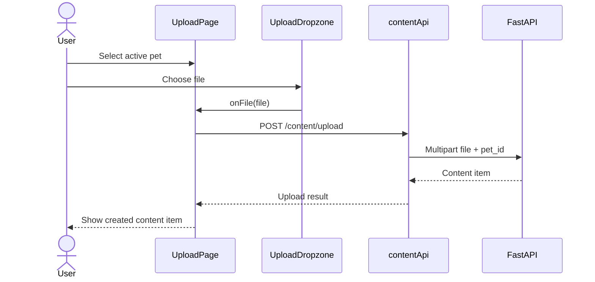

### 15.5. Chat Flow

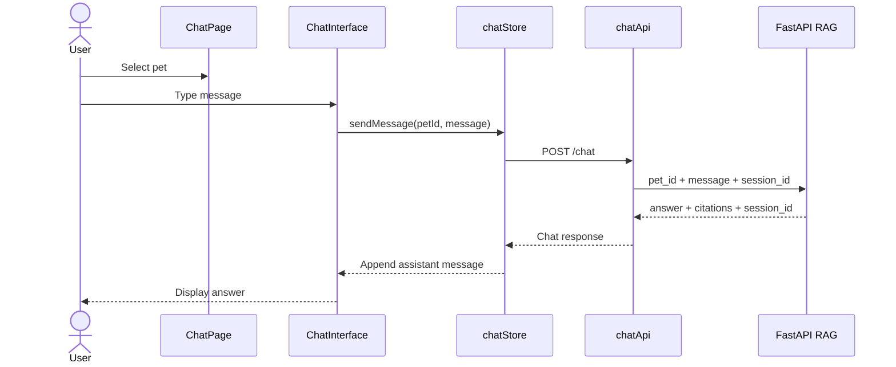

## 16. UI and UX Design Principles

The frontend interface follows these design principles:

- **Pet-first navigation**: Most workflows depend on selecting a pet.
- **Clear empty states**: Empty content and empty pet states guide the user to the next action.
- **Responsive layout**: Desktop uses sidebar navigation, mobile uses bottom navigation.
- **Consistent visual language**: Green medical identity, white cards, icon-based actions.
- **Safety messaging**: AI chat includes a disclaimer that it does not replace professional veterinary diagnosis.
- **Action feedback**: Forms show loading state and errors.
- **Confirmation for destructive actions**: Pet deletion requires user confirmation.

## 17. Layout and Visual Design System

### 17.1. Overall Layout Strategy

The frontend layout is designed as a dashboard-style web application rather than a marketing website. The protected application area uses a stable shell layout:

- Desktop: fixed sidebar on the left, sticky navbar on top, content area on the right.
- Mobile: top navbar and bottom navigation bar.
- Content pages use constrained spacing, responsive grids, and card-based sections.
- Important actions are placed near page headers or inside relevant cards.

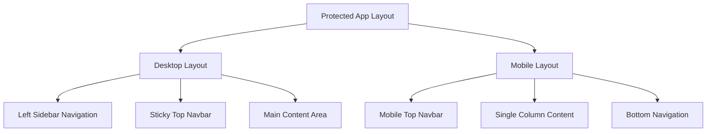

### 17.2. Page Layout Pattern

Most protected pages follow this structure:

```txt
Page
├── Header area
│   ├── Eyebrow label
│   ├── Page title
│   └── Short description
├── Action area
│   └── Select, create, upload, or chat action
├── Main content
│   ├── Cards
│   ├── Forms
│   ├── Lists
│   └── Empty states
└── Supporting section
    └── Status, pipeline, settings, or helper information
```

This pattern keeps the interface predictable. Users can quickly understand where they are, what the page does, and what action they should take next.

### 17.3. Box and Card Design

The interface uses several box/card styles:

| Style | Usage | Visual intention |
| --- | --- | --- |
| `glass-panel` | Auth pages, landing hero, high-emphasis panels | Light translucent panel with soft border and shadow |
| `surface-card` | Main dashboard cards and page sections | Clean white surface for primary content |
| `soft-card` | Smaller repeated cards such as content items | Lightweight white box with subtle shadow |
| `stat-card` | Dashboard statistics | Compact metric card with icon and value |
| `empty-state` | No pet, no content, no data states | Dashed border and guidance text |

Design rules:

- Cards use rounded corners around `22px-28px` for a soft medical workspace feel.
- Borders use pale green/gray tones to avoid harsh separation.
- Shadows are subtle and used to create hierarchy, not decoration.
- Empty states are visually different from normal cards so users understand that action is needed.
- Repeated data items use consistent card spacing and icon placement.

### 17.4. Color Palette

The frontend uses a calm healthcare-inspired palette with green as the main brand color and neutral surfaces for readability.

| Purpose | Color | Usage |
| --- | --- | --- |
| Primary green | `#169b74`, `#1f9f78` | Primary buttons, selected state, logo border |
| Dark ink | `#17312b` | Headings, sidebar active state, important text |
| Muted text | `#527b70` | Descriptions, secondary labels |
| Soft green background | `#effbf6`, `#f1fbf7` | Success states, pet cards, icon containers |
| Border green-gray | `#d8ede5`, `#c7e2d8` | Card borders and input borders |
| Amber accent | `#fff7e8`, `#a76210` | Warnings, upload/pending state |
| Blue accent | `#edf6ff`, `#25608a` | Informational cards |
| Coral/red accent | `#fff1ee`, `#a64431`, `#dc2626` | Delete and error states |
| White surface | `#ffffff` | Cards, inputs, panels |

Color usage principles:

- Green represents health, safety, and the product identity.
- Dark ink is used for strong contrast in titles and active navigation.
- Amber is used for caution or processing.
- Red/coral is reserved for destructive actions and errors.
- Blue is used sparingly for informational accents.
- The UI avoids using only one green tone by mixing neutral, amber, blue, and coral accents.

### 17.5. Typography

The application uses a modern sans-serif stack based on Inter/system UI.

Typography rules:

- Page titles use large, bold text for clear hierarchy.
- Card titles use smaller bold text to avoid overcrowding.
- Descriptions use muted text color.
- Buttons use bold labels for clear actions.
- Letter spacing is kept normal for readability.
- Text inside compact UI components is kept short.

### 17.6. Button Design

Button types:

| Button | Usage | Style |
| --- | --- | --- |
| Primary button | Main actions such as login, register, add pet, upload, open app | Green background, white text |
| Secondary button | Supporting actions such as sign in or ask assistant | White background, green-gray border |
| Icon button | Logout, delete pet, send chat message | Square button with clear icon |

Button design rules:

- Primary buttons are used only for the most important action in a section.
- Secondary buttons support navigation or lower-priority actions.
- Destructive buttons use red/coral styling.
- Icon buttons include `aria-label` or `title` when the icon alone may not be clear.
- Buttons have enough height for touch interaction.

### 17.7. Input and Form Design

Forms are used in:

- Login page
- Register page
- Pet creation form
- Pet selector dropdowns
- Chat input
- Upload file selection

Input design:

- Inputs use rounded corners and light borders.
- Focus state uses a green outline shadow.
- Forms are grouped inside cards or panels.
- Error messages are shown near the related form.
- Disabled states are visible, especially upload/chat when no pet is selected.

### 17.8. Component Visual Design

Important component design decisions:

| Component | Design behavior |
| --- | --- |
| `Sidebar` | White translucent sidebar, dark active nav item, logo at top |
| `Navbar` | Sticky top bar, user info, large logout icon |
| `MobileNav` | Bottom navigation for mobile screens |
| `PetCard` | Species icon, selected badge, health metadata chips, delete action |
| `PetProfileForm` | Compact form with medical icon and grouped fields |
| `UploadDropzone` | Large dashed card with file type chips |
| `UploadProgress` | Simple progress bar with percentage |
| `DocumentViewer` | File icon, title, type/source, status pill |
| `ChatInterface` | Bordered chat surface with assistant header and prompt suggestions |
| `ChatMessage` | User message aligned right, assistant message aligned left |
| `SettingsPage` | Service configuration cards with icons |

### 17.9. Empty State Design

Empty states are important because a new user starts with no pets and no uploaded content.

Examples:

- Dashboard: no pet profiles yet.
- Pet Profiles: create the first profile.
- Content: no content items yet.
- Chat: select a pet to start chatting.

Empty state design rules:

- Explain what is missing.
- Tell the user what to do next.
- Provide a direct action when possible.
- Use softer dashed card styling to distinguish it from normal data cards.

### 17.10. Responsive Box Layout

Responsive behavior:

- Dashboard statistics change from one column to two or four columns depending on screen width.
- Pet cards use one column on small screens and multiple columns on larger screens.
- Upload page changes from a two-column layout to a single-column layout on mobile.
- Auth pages use two-column layout on desktop and single-column layout on mobile.
- Chat height is adjusted to fit the viewport while keeping the input visible.

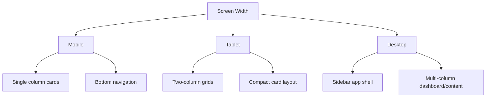

### 17.11. Visual Hierarchy

The interface uses hierarchy in this order:

1. Page title
2. Primary action
3. Main content card
4. Supporting cards
5. Metadata chips and helper text

This helps users scan the screen quickly and understand the next meaningful action.

### 17.12. Design Consistency Rules

The frontend follows these consistency rules:

- Use the same green brand color for positive and primary actions.
- Use red only for errors and deletion.
- Use cards for grouped information, not every page section.
- Keep icons from the same icon family: Lucide React.
- Keep page headers consistent across dashboard, pet, upload, content, chat, and settings.
- Use selected states clearly when a pet is active.
- Keep mobile navigation always accessible.

## 18. Responsive Design

Desktop:

- Sidebar navigation is visible.
- Content area uses multi-column layouts.
- Dashboard cards are arranged in grid form.

Mobile:

- Sidebar is hidden.
- Mobile bottom navigation is shown.
- Content uses single-column layout.
- Buttons and inputs maintain touch-friendly sizes.

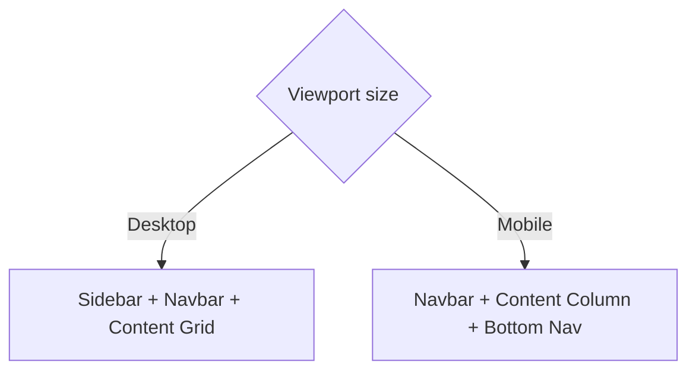

## 19. Error Handling Design

| Area | Handling |
| --- | --- |
| Login/Register | Show user-facing error from backend |
| Upload without pet | Disable upload and show instruction |
| Chat without pet | Disable chat input and ask user to select pet |
| API error | Store-level catch and UI error text where available |
| Delete pet | Confirmation before API call |
| Empty data | Empty state cards with guidance |

## 20. Environment Configuration

Frontend environment variable:

```env
VITE_API_BASE_URL=https://kientapchoem.onrender.com
```

Local fallback:

```txt
http://localhost:8000
```

The environment variable is used by Axios in `api/client.js` to determine where API requests should be sent.

## 21. Build and Deployment Design

The frontend is built with Vite and deployed as static assets.

Build command:

```bash
npm run build
```

Output directory:

```txt
dist
```

Deployment target:

```txt
Vercel
```

Deployment flow:

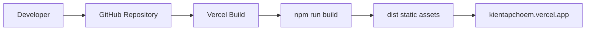

## 22. Frontend Security Considerations

Current security behavior:

- Protected routes require a token.
- JWT is attached to API requests through Axios interceptor.
- Auth state is persisted for user convenience.
- Logout clears token and user data.
- Backend remains the source of truth for authorization.

Important note:

Frontend route protection improves user experience but is not sufficient for real security by itself. Backend JWT validation is required for every protected API call.

## 23. Accessibility and Usability Considerations

The frontend includes:

- Clear button labels and icon buttons with `aria-label` where needed.
- Large touch targets for primary actions.
- High contrast main action buttons.
- Responsive layout for mobile and desktop.
- Visible loading states for auth and chat.
- Confirm dialog for destructive pet deletion.

Future improvements:

- Add full keyboard focus styling review.
- Add toast notifications.
- Add form field labels for better screen reader support.
- Add skeleton loading for dashboard/content.

## 24. Frontend Limitations

Current limitations:

- Chat messages are stored in runtime state and reset on refresh.
- No global toast notification system yet.
- No advanced form validation library.
- No frontend unit tests yet.
- No separate admin or veterinarian interface.
- Upload progress depends on browser upload event only, not backend ingestion progress.

## 25. Future Frontend Enhancements

Recommended improvements:

- Add chat session history list.
- Add edit pet profile modal.
- Add content detail page.
- Add ingestion status polling.
- Add vaccine timeline UI.
- Add health report export UI.
- Add profile avatar upload.
- Add admin dashboard.
- Add veterinarian view.
- Add frontend tests with Vitest and React Testing Library.
- Add e2e tests with Playwright.

## 26. Frontend Testing Plan

Manual test cases:

| Test Case | Expected Result |
| --- | --- |
| Open landing page | Landing page renders with login/register actions |
| Register valid account | User is redirected to dashboard |
| Login valid account | User is redirected to dashboard |
| Open `/app` without token | User is redirected to login |
| Create pet | New pet appears and becomes selected |
| Delete pet | Pet is removed after confirmation |
| Upload without selected pet | Upload is disabled |
| Upload with selected pet | Content item is created |
| Open content page | Content items are listed |
| Chat without selected pet | Input is disabled |
| Chat with selected pet | User and assistant messages appear |
| Logout | Token is cleared and user exits protected state |

Suggested automated tests:

- Component tests for forms and cards.
- Store tests for auth, pet, and chat actions.
- API mock tests for success/error states.
- E2E tests for login, pet creation, upload, and chat.

## 27. Summary

The GPet Vet AI frontend is a React Vite SPA designed around a pet-centered workflow. It provides a responsive user interface for authentication, pet management, upload, content viewing, and AI chat. The frontend is separated into clear layers: pages, reusable components, Zustand stores, and Axios API clients.

This design allows the frontend to remain maintainable, deployable, and extensible as the system grows toward more advanced veterinary workflows such as reminders, reports, veterinarian roles, and richer AI-assisted analysis.
