# GPet Vet AI - System Diagrams

Tai lieu nay mo ta tong quan kien truc, cac luong hoat dong chinh, va mo hinh du lieu cua he thong GPet Vet AI.

## 0. Mo Ta He Thong

### 0.1. Gioi Thieu

**GPet Vet AI** la mot nen tang quan ly suc khoe thu cung ket hop tri tue nhan tao. He thong duoc xay dung de ho tro nguoi nuoi thu cung luu tru, quan ly va khai thac thong tin y te cua tung thu cung trong mot khong gian tap trung.

Thay vi de ho so tiem phong, ket qua xet nghiem, don thuoc, ghi chu suc khoe va lich su hoi dap nam rai rac o nhieu noi, GPet Vet AI gom tat ca thanh mot bo nho so cho tung pet. Tu bo nho nay, chatbot AI co the tra loi cac cau hoi lien quan den tinh trang, lich su y te, tai lieu da upload va cac cuoc tro chuyen truoc do.

He thong khong thay the chan doan cua bac si thu y. Moi cau tra loi cua AI chi mang tinh tham khao, ho tro nguoi dung hieu thong tin va chuan bi cau hoi tot hon khi lam viec voi chuyen gia thu y.

### 0.2. Muc Tieu He Thong

Muc tieu chinh cua he thong la:

- Quan ly nhieu ho so thu cung trong cung mot tai khoan.
- Luu tru thong tin co cau truc nhu ten, loai, giong, can nang, gioi tinh.
- Cho phep upload tai lieu y te, hinh anh, audio, video va cac nguon kien thuc lien quan.
- Chuyen cac file upload thanh noi dung co the tim kiem va dung lam ngu canh cho chatbot.
- Cung cap chatbot AI co kha nang tra loi dua tren ho so pet, tai lieu da upload va lich su hoi dap.
- Ho tro deploy thuc te voi frontend tren Vercel, backend tren Render, database tren MongoDB Atlas va AI qua Gemini API.

### 0.3. Doi Tuong Su Dung

He thong huong den cac nhom nguoi dung sau:

- **Pet owner**: nguoi nuoi thu cung, can theo doi suc khoe, tai lieu, lich tiem phong va cau hoi hang ngay.
- **Admin**: vai tro quan tri trong tuong lai, co the quan ly nguoi dung, noi dung va cau hinh he thong.
- **Veterinarian**: vai tro mo rong trong tuong lai, co the xem ho so pet va dua ra tu van chuyen mon.

Phien ban hien tai tap trung vao vai tro **pet_owner**.

### 0.4. Pham Vi Chuc Nang Hien Tai

He thong hien tai bao gom cac module chinh:

| Module | Mo ta |
| --- | --- |
| Authentication | Dang ky, dang nhap, tao JWT, bao ve route backend/frontend |
| Dashboard | Tong quan so luong pet, trang thai workspace, truy cap nhanh den cac module |
| Pet Profiles | Tao, xem, chon va xoa ho so thu cung |
| Knowledge Upload | Upload file cho pet da chon, tao content item va xu ly ingestion |
| Content Library | Hien thi danh sach noi dung da upload theo pet |
| AI Chat | Chatbot tra loi dua tren pet profile, chat memory va retrieved content chunks |
| Settings | Hien thi cau hinh dich vu production dang su dung |
| Health Checks | Kiem tra backend, MongoDB va Gemini API |

### 0.5. Cong Nghe Su Dung

| Lop he thong | Cong nghe |
| --- | --- |
| Frontend | React, Vite, React Router, Zustand, Axios, Tailwind CSS, Lucide Icons |
| Backend | FastAPI, Pydantic, Uvicorn |
| Database | MongoDB Atlas, Motor Async Driver |
| Authentication | JWT, password hashing |
| AI Generation | Google Gemini Generate Content API |
| Embedding | Gemini Embedding API |
| Deployment Frontend | Vercel |
| Deployment Backend | Render |
| Local Development | Node.js, Python, MongoDB Compass |

### 0.6. Cach He Thong Hoat Dong O Muc Tong Quan

1. Nguoi dung truy cap frontend tren Vercel.
2. Nguoi dung dang ky hoac dang nhap.
3. Backend xac thuc thong tin, tao JWT va tra ve frontend.
4. Frontend luu token va gui token trong header moi khi goi API protected.
5. Nguoi dung tao mot hoac nhieu profile pet.
6. Nguoi dung chon pet va upload tai lieu/hinh anh/video/audio.
7. Backend luu file, tao content item, sau do xu ly ingestion.
8. Pipeline ingestion trich xuat noi dung, chia chunk, tao embedding va luu vao MongoDB.
9. Khi nguoi dung hoi chatbot, backend lay lich su chat va cac chunk lien quan cua pet.
10. Backend tao prompt RAG va goi Gemini de sinh cau tra loi.
11. Cau tra loi duoc tra ve frontend va dong thoi luu vao chat history.

### 0.7. Nguyen Tac Thiet Ke

He thong duoc thiet ke theo cac nguyen tac:

- **Tach lop ro rang**: frontend, backend, database va AI service duoc tach rieng.
- **API-first**: frontend giao tiep voi backend thong qua REST API.
- **Pet-centric**: hau het du lieu quan trong deu gan voi `pet_id` va `owner_id`.
- **Unified content**: moi loai file upload deu duoc chuan hoa thanh `content_item` va `content_chunk`.
- **RAG before answer**: chatbot uu tien lay ngu canh tu du lieu cua pet truoc khi tao cau tra loi.
- **Security by owner_id**: moi truy van protected deu dua tren user hien tai tu JWT.
- **Deployable architecture**: cau truc phu hop de deploy tren Vercel, Render va MongoDB Atlas.

### 0.8. Gioi Han Va Huong Mo Rong

Gioi han hien tai:

- AI chi ho tro tu van tham khao, khong thay the bac si thu y.
- Upload storage tren Render filesystem co the khong ben vung nhu object storage rieng.
- Chua co giao dien quan tri admin.
- Chua co Google login, forgot password, nhac lich tiem phong tu dong.
- Vector search hien tai duoc thiet ke theo chunk trong MongoDB, co the mo rong sang FAISS hoac vector database rieng.

Huong mo rong:

- Them role veterinarian de bac si xem va ghi chu ho so pet.
- Them lich tiem phong va reminder.
- Them object storage nhu S3/Cloudinary cho file upload.
- Them vector database rieng cho retrieval nhanh hon.
- Them dashboard thong ke suc khoe va timeline y te.
- Them export report PDF cho lich su y te cua pet.

### 0.9. Yeu Cau Phi Chuc Nang

| Nhom yeu cau | Mo ta |
| --- | --- |
| Bao mat | API protected phai yeu cau JWT, du lieu truy van theo `owner_id`, password duoc hash truoc khi luu |
| Kha nang deploy | Frontend va backend tach rieng, cau hinh qua bien moi truong |
| Kha nang mo rong | Co the them role, them loai file, them vector database hoac object storage |
| Kha nang bao tri | Backend chia router, schema, repository, service ro rang |
| Tinh san sang | Co `/health`, `/health/db`, `/health/ai` de kiem tra dich vu |
| Trai nghiem nguoi dung | Giao dien co dashboard, empty state, confirm khi xoa, loading state |
| An toan y te | Chatbot luon can disclaimer, khong thay the chan doan chuyen mon |

### 0.10. Cau Truc Thu Muc Du An

```txt
KIENTAPCHOEM/
├── BRAINSTORM.MD
├── docs/
│   └── SYSTEM_DIAGRAMS.md
├── thucung-api/
│   ├── app/
│   │   ├── api/
│   │   │   ├── deps.py
│   │   │   └── routes/
│   │   │       ├── auth.py
│   │   │       ├── chat.py
│   │   │       ├── content.py
│   │   │       ├── health.py
│   │   │       ├── pets.py
│   │   │       └── upload.py
│   │   ├── core/
│   │   │   ├── config.py
│   │   │   ├── database.py
│   │   │   └── security.py
│   │   ├── models/
│   │   ├── schemas/
│   │   └── services/
│   │       ├── ai/
│   │       ├── ingest/
│   │       ├── rag/
│   │       ├── repositories/
│   │       └── storage/
│   └── main.py
└── thucung-web/
    ├── src/
    │   ├── api/
    │   ├── components/
    │   │   ├── chat/
    │   │   ├── content/
    │   │   ├── layout/
    │   │   ├── pet/
    │   │   └── upload/
    │   ├── pages/
    │   ├── store/
    │   ├── App.jsx
    │   └── main.jsx
    └── vercel.json
```

### 0.11. Mo Ta Cac Module Backend

| Module | Trach nhiem |
| --- | --- |
| `api/routes/auth.py` | Dang ky, dang nhap, lay thong tin user hien tai |
| `api/routes/pets.py` | CRUD pet, xoa cascade content/chat khi xoa pet |
| `api/routes/content.py` | Liet ke content va tao content tu URL trong tuong lai |
| `api/routes/upload.py` | Nhan file upload, luu file, tao content item, kich hoat ingestion background |
| `api/routes/chat.py` | Nhan cau hoi va tra ve cau tra loi RAG |
| `api/routes/health.py` | Kiem tra backend, MongoDB, Gemini |
| `core/config.py` | Doc bien moi truong va cau hinh ung dung |
| `core/database.py` | Khoi tao ket noi MongoDB bang Motor |
| `core/security.py` | Hash password, verify password, tao JWT |
| `services/repositories/*` | Dong goi thao tac MongoDB |
| `services/ingest/*` | Xu ly file upload thanh text/chunk/embedding |
| `services/rag/*` | Tao prompt, retrieval, dieu phoi chatbot |
| `services/ai/*` | Goi Gemini generate va embedding |
| `services/storage/*` | Luu file upload local |

### 0.12. Mo Ta Cac Module Frontend

| Module | Trach nhiem |
| --- | --- |
| `api/client.js` | Cau hinh Axios, base URL, gan Authorization header |
| `api/authApi.js` | Goi API dang ky/dang nhap/me |
| `api/petApi.js` | Goi API CRUD pet |
| `api/contentApi.js` | Goi API content/upload |
| `api/chatApi.js` | Goi API chat |
| `store/authStore.js` | Luu token, user, trang thai auth |
| `store/petStore.js` | Luu danh sach pet, pet dang chon, tao/xoa pet |
| `store/chatStore.js` | Luu messages, session_id, gui cau hoi |
| `components/layout/*` | App shell, sidebar, navbar, mobile nav |
| `components/pet/*` | Card pet va form tao pet |
| `components/upload/*` | Dropzone va progress upload |
| `components/chat/*` | Khung chat, message bubble, input |
| `pages/*` | Cac man hinh chinh cua ung dung |

### 0.13. Luong Du Lieu Theo Owner Va Pet

Moi du lieu nghiep vu quan trong deu duoc gan voi:

- `owner_id`: id cua user dang so huu du lieu.
- `pet_id`: id cua pet ma du lieu thuoc ve.

Nguyen tac nay giup:

- Nguoi dung chi xem duoc du lieu cua minh.
- Chatbot chi lay context cua pet dang duoc chon.
- Khi xoa pet co the xoa dung content/chat lien quan.
- He thong de mo rong sang nhieu role va nhieu pet.

### 0.14. Vong Doi Content Item

```txt
uploaded
  -> processing
  -> ready
  -> failed
```

Y nghia:

- `uploaded`: file da duoc nhan va content item da duoc tao.
- `processing`: backend dang extract text, chunk va tao embedding.
- `ready`: noi dung da san sang lam context cho chatbot.
- `failed`: pipeline loi, content item can duoc retry hoac upload lai.

### 0.15. Chien Luoc RAG

RAG trong he thong hien tai hoat dong theo cac buoc:

1. Lay lich su chat gan nhat cua session.
2. Lay chunks da luu cua pet hien tai.
3. So khop/retrieve cac chunks lien quan den cau hoi.
4. Tao prompt gom:
   - system instruction
   - safety disclaimer
   - conversation memory
   - retrieved pet context
   - user question
5. Goi Gemini Generate Content API.
6. Luu answer va citations vao chat history.

### 0.16. Quan Ly Loi

| Tinh huong | Cach xu ly hien tai |
| --- | --- |
| MongoDB loi luc startup | Backend van khoi dong, `/health/db` bao loi chi tiet |
| Gemini model sai | Gemini service thu model trong env, sau do fallback sang model mac dinh |
| Chua co Gemini API key | Chatbot tra ve message cau hinh thieu API key |
| Chua chon pet khi upload/chat | Frontend disable thao tac va hien thong bao |
| Xoa pet khong ton tai | Backend tra `404 Pet not found` |
| Login sai | Backend tra loi auth, frontend hien thi loi |

### 0.17. Bao Mat Va Quyen Truy Cap

Co che bao mat hien tai:

- Password duoc hash, khong luu plain text.
- JWT duoc tao sau khi login/register thanh cong.
- Frontend gan token vao `Authorization: Bearer <token>`.
- Backend dung dependency `get_current_user` de lay user hien tai.
- Cac repository truy van theo `owner_id`.
- CORS chi cho phep frontend domain duoc cau hinh.

Can cai thien trong tuong lai:

- Them refresh token.
- Them forgot password.
- Them rate limit cho login/chat.
- Them audit log cho hanh dong xoa.
- Them phan quyen chi tiet cho admin/veterinarian.

### 0.18. Van Hanh Va Health Check

Backend co cac endpoint van hanh:

| Endpoint | Muc dich |
| --- | --- |
| `GET /health` | Kiem tra API con song |
| `GET /health/db` | Kiem tra ket noi MongoDB va so collection |
| `GET /health/ai` | Kiem tra Gemini API va model |

Quy trinh kiem tra sau deploy:

1. Mo `https://kientapchoem.onrender.com/health`.
2. Mo `https://kientapchoem.onrender.com/health/db`.
3. Mo `https://kientapchoem.onrender.com/health/ai`.
4. Mo frontend Vercel.
5. Dang ky/dang nhap thu.
6. Tao pet, upload file, chat thu.

### 0.19. Checklist Deploy

Frontend Vercel:

- Root directory: `thucung-web`
- Build command: `npm run build`
- Output directory: `dist`
- Environment:
  - `VITE_API_BASE_URL=https://kientapchoem.onrender.com`

Backend Render:

- Root directory: `thucung-api`
- Build command: `pip install -r requirements.txt`
- Start command: `uvicorn main:app --host 0.0.0.0 --port $PORT`
- Environment:
  - `MONGO_URI`
  - `MONGO_DB`
  - `JWT_SECRET`
  - `CORS_ORIGINS`
  - `GEMINI_API_KEY`
  - `GEMINI_BASE_URL`
  - `GEMINI_MODEL`
  - `EMBEDDING_MODEL`

MongoDB Atlas:

- Tao database user.
- Lay connection string SRV.
- Them IP access list cho Render.
- Kiem tra ket noi bang MongoDB Compass.

### 0.20. Kich Ban Su Dung Mau

Kich ban 1: nguoi dung moi

1. User vao landing page.
2. Bam Create account.
3. Dang ky tai khoan.
4. Vao dashboard.
5. Tao pet dau tien.
6. Chon pet va upload ho so tiem phong.
7. Mo AI Chat va hoi: "Thu cung cua toi da tiem nhung vaccine nao?"

Kich ban 2: theo doi lich su y te

1. User upload don thuoc, ket qua xet nghiem, ghi chu benh.
2. He thong xu ly thanh chunks.
3. User hoi: "Tom tat lich su y te cua pet nay".
4. Chatbot tra loi dua tren noi dung da upload va chat memory.

Kich ban 3: xoa pet

1. User mo Pet Profiles.
2. Bam icon thung rac tren pet card.
3. Frontend hien confirm.
4. Backend xoa pet va content/chat lien quan.
5. Frontend cap nhat lai danh sach pet.

### 0.21. Ranh Gioi He Thong

Nam trong pham vi he thong:

- Quan ly user, pet, content, chat.
- Luu file upload local tren backend.
- Luu metadata va chunks trong MongoDB.
- Goi Gemini API de generate va embedding.
- Giao dien web cho nguoi dung.

Nam ngoai pham vi hien tai:

- Chan doan y te chinh thuc.
- Thanh toan.
- Dat lich kham.
- Quan ly phong kham.
- Object storage ben ngoai.
- Vector database rieng.
- Mobile app native.

### 0.22. Rủi Ro Ky Thuat

| Rui ro | Anh huong | Huong xu ly |
| --- | --- | --- |
| Render free instance sleep | Request dau tien cham | Dung paid instance hoac ping/keep-alive hop le |
| Render filesystem khong ben vung | File upload co the mat khi redeploy | Chuyen sang S3/Cloudinary |
| Gemini quota het | Chatbot loi | Theo doi quota, fallback message ro rang |
| MongoDB Atlas IP block | Backend khong ket noi duoc DB | Cau hinh IP Access List dung cho Render |
| Model Gemini thay doi | 404 khi generate | Dung fallback model va health check |
| Du lieu pet nhay cam | Lo ro ri thong tin | Tang bao mat, audit log, encryption neu can |

### 0.23. Huong Kiem Thu

Frontend:

- Test login/register form.
- Test protected route khi khong co token.
- Test tao/xoa pet.
- Test upload khi chua chon pet va khi da chon pet.
- Test chat khi chua chon pet va khi da chon pet.

Backend:

- Test `/health`, `/health/db`, `/health/ai`.
- Test auth register/login.
- Test CRUD pet.
- Test delete pet cascade.
- Test upload tao content item.
- Test chat tao session va luu messages.

End-to-end:

- Dang ky user moi.
- Tao pet.
- Upload file.
- Chat voi pet.
- Xoa pet.
- Kiem tra MongoDB khong con content/chat cua pet da xoa.

## 1. Tong Quan He Thong

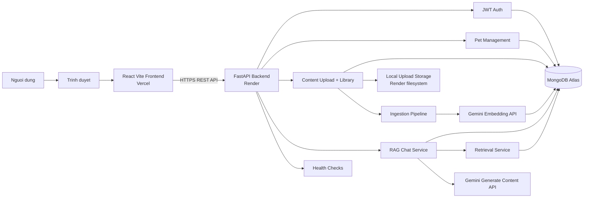

### Vai tro cac thanh phan

- **React Vite Frontend**: giao dien nguoi dung, login/register, dashboard, pet profile, upload, content library, chatbot.
- **FastAPI Backend**: xu ly API, JWT, pet CRUD, upload, RAG chat, health check.
- **MongoDB Atlas**: luu user, pet, content item, content chunk, chat session, chat message.
- **Gemini API**: sinh cau tra loi chatbot va tao embedding cho chunk noi dung.
- **Render/Vercel**: Render chay backend, Vercel chay frontend.

## 2. Kien Truc Frontend

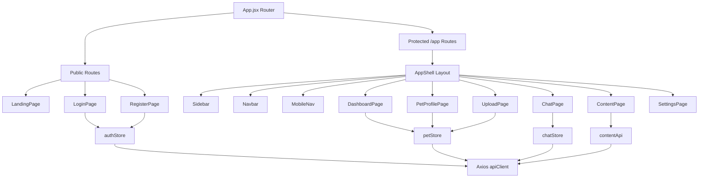

## 3. Kien Truc Backend

```mermaid
flowchart TD
    FastAPI[FastAPI app/main.py] --> CORS[CORS Middleware]
    FastAPI --> Routes[API Routers]

    Routes --> AuthRouter[/auth]
    Routes --> PetRouter[/pets]
    Routes --> ContentRouter[/content]
    Routes --> UploadRouter[/content/upload]
    Routes --> ChatRouter[/chat]
    Routes --> HealthRouter[/health]

    AuthRouter --> UserRepo[UserRepository]
    PetRouter --> PetRepo[PetRepository]
    PetRouter --> ContentRepo[ContentRepository]
    PetRouter --> ChatRepo[ChatRepository]
    ContentRouter --> ContentRepo
    UploadRouter --> Storage[LocalStorage]
    UploadRouter --> Ingest[ContentIngestService]
    ChatRouter --> Rag[RagService]

    UserRepo --> Mongo[(MongoDB)]
    PetRepo --> Mongo
    ContentRepo --> Mongo
    ChatRepo --> Mongo

    Ingest --> DocIngest[Document/Image/Video Ingest]
    Ingest --> Chunking[Chunking]
    Ingest --> Embeddings[EmbeddingsService]
    Embeddings --> GeminiEmbed[Gemini Embedding API]

    Rag --> Retrieval[RetrievalService]
    Retrieval --> ContentRepo
    Rag --> Gemini[GeminiService]
    Gemini --> GeminiAPI[Gemini Generate API]
```

## 4. Luong Dang Ky Tai Khoan

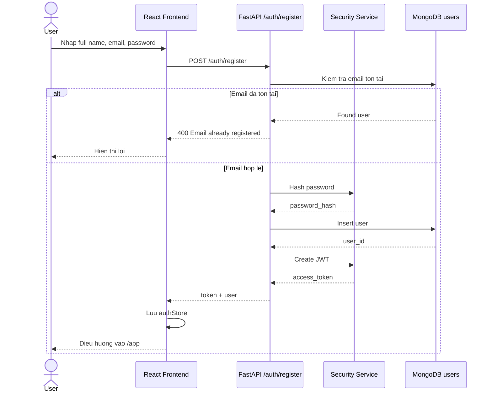

## 5. Luong Dang Nhap

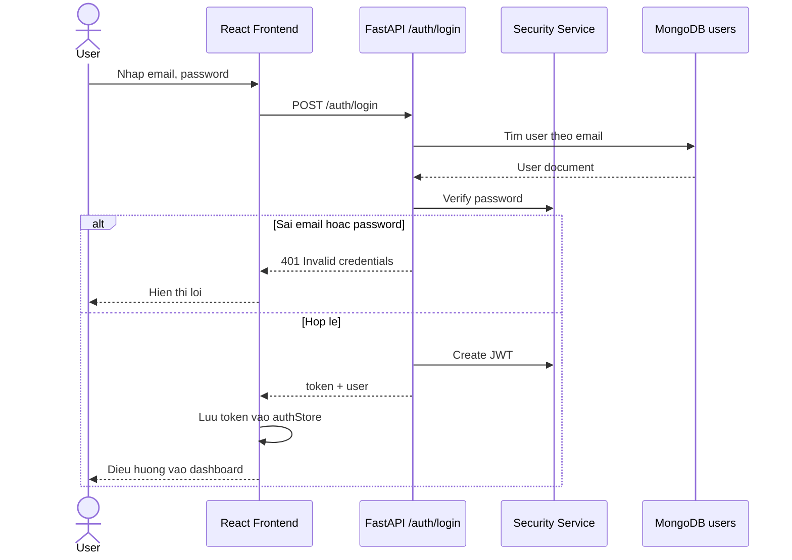

## 6. Luong Quan Ly Pet

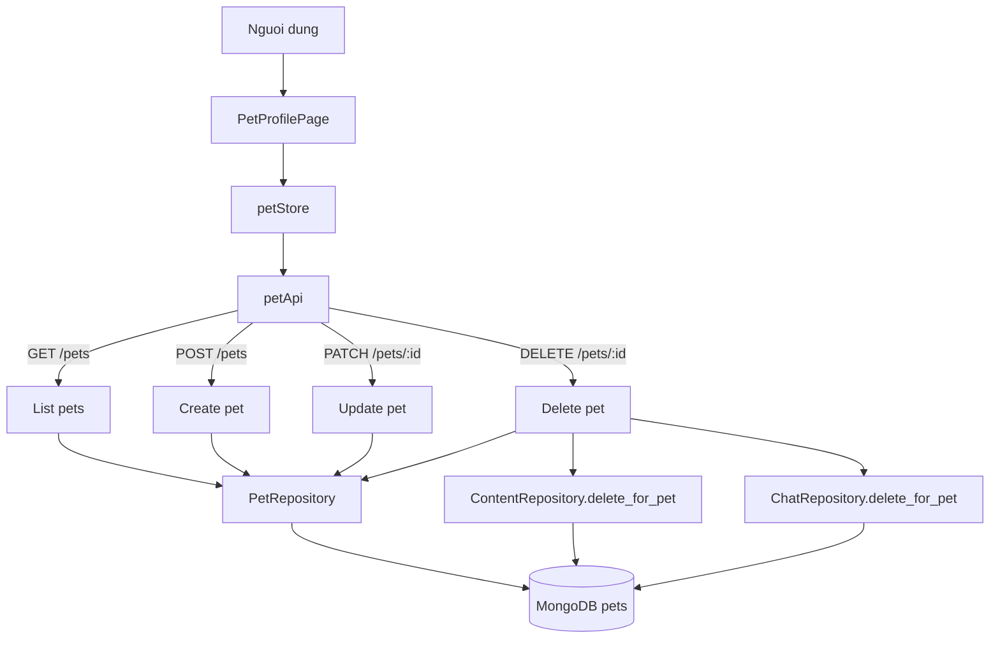

### Xoa pet dang lam gi?

Khi user xoa mot pet, backend xoa:

- Pet document trong `pets`
- Content item cua pet trong `content_items`
- Content chunks cua pet trong `content_chunks`
- Chat session cua pet trong `chat_sessions`
- Chat messages cua pet trong `chat_messages`

## 7. Luong Upload Va Xu Ly Kien Thuc

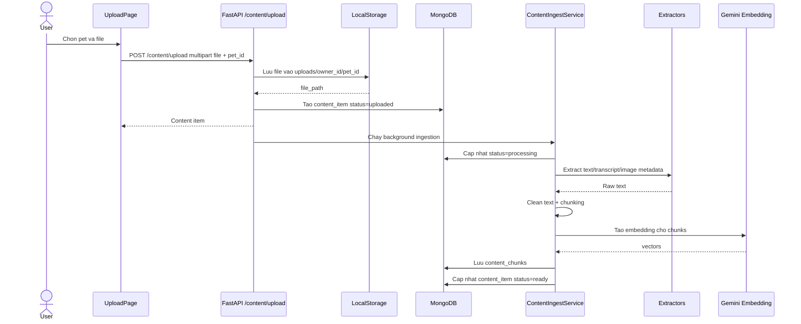

## 8. Luong RAG Chatbot

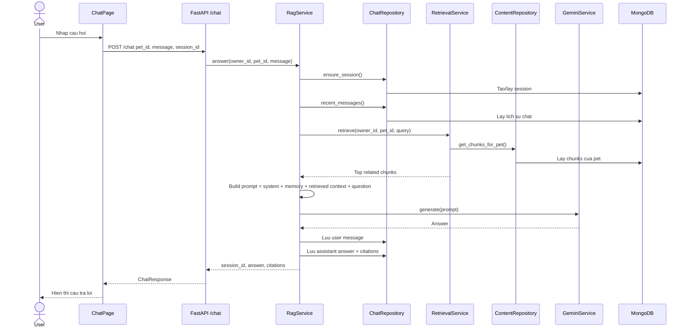

## 9. Activity Diagram - Chatbot

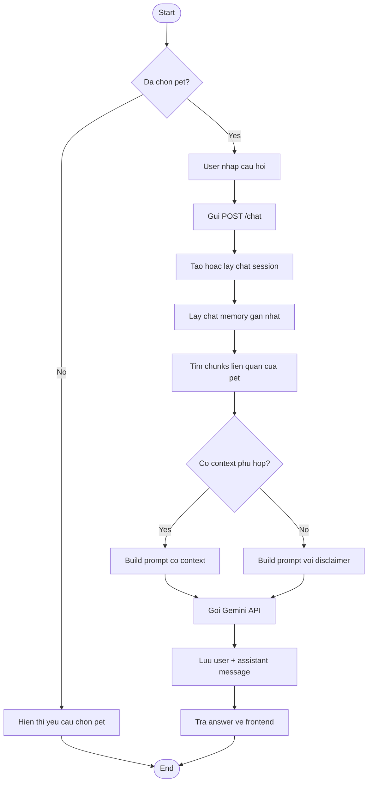

## 10. Activity Diagram - Upload

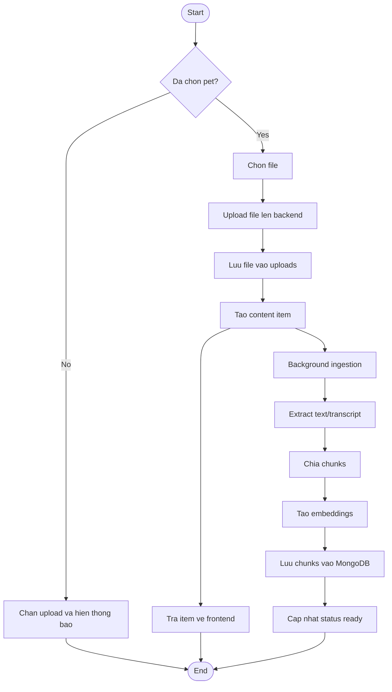

## 11. Deployment Diagram

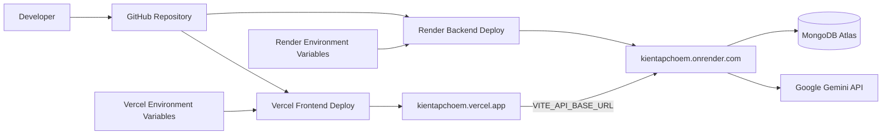

### Bien moi truong quan trong

Frontend:

```env
VITE_API_BASE_URL=https://kientapchoem.onrender.com
```

Backend:

```env
MONGO_URI=mongodb+srv://...
MONGO_DB=gpet_vet_ai
JWT_SECRET=...
CORS_ORIGINS=https://kientapchoem.vercel.app
GEMINI_API_KEY=...
GEMINI_BASE_URL=https://generativelanguage.googleapis.com/v1beta
GEMINI_MODEL=gemini-2.5-flash
EMBEDDING_MODEL=gemini-embedding-001
```

## 12. Mo Hinh Du Lieu MongoDB

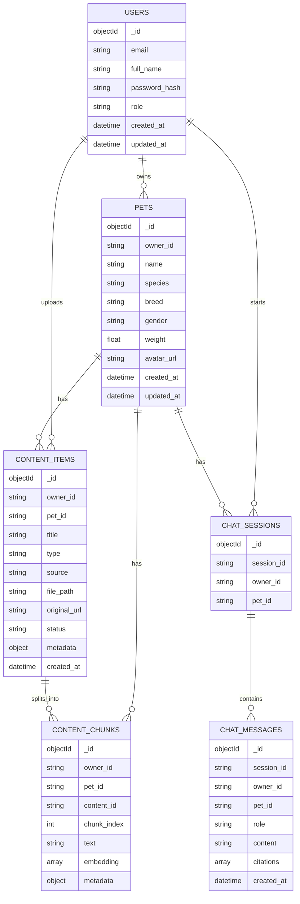

## 13. API Surface Tong Quan

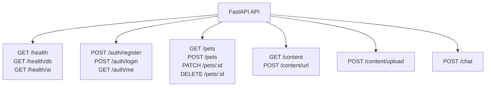

## 14. Luong Bao Mat JWT

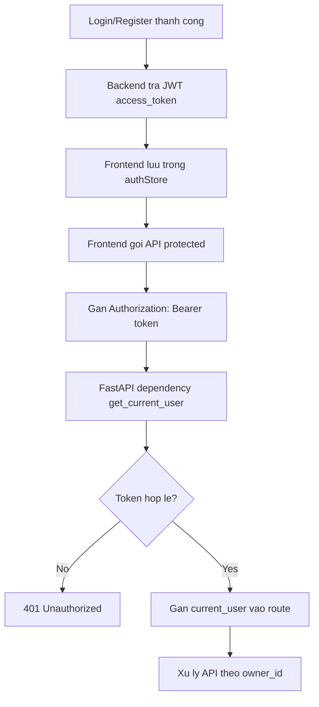

## 15. Tom Tat Luong Hoat Dong Chinh

1. User dang ky/dang nhap, backend tao JWT.
2. Frontend luu JWT va dung token de goi cac API protected.
3. User tao profile cho tung pet.
4. User chon pet va upload tai lieu/anh/video/audio.
5. Backend luu file, tao content item, chay pipeline extract/chunk/embed.
6. Chunks va metadata duoc luu vao MongoDB.
7. Khi user chat, backend lay chat memory + chunks lien quan cua pet.
8. Backend build prompt RAG va goi Gemini.
9. Cau tra loi va citations duoc luu vao chat history.
10. Neu user xoa pet, backend xoa pet va toan bo content/chat lien quan.
